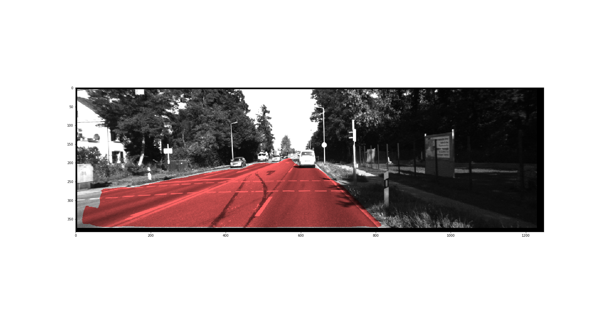

# RoadSegmentationWithUnet
## 1. prepare images and masks for KITTI (prepareImageMask.py)
original training images and masks are not ready for training for 3 reasons:
1. Samples are RGB images, however, the sizes (row, cols) are not the same. They need to be resized
    into the same dimension. The resize uses padding 0s to 1248X384 in size.
2. Masks are RGB images with 3 channels, only the first channel records the label of road
    this preprocessing will pick the first channel, and save it as a gray image with values between
    0-255.
3. There are more masks than the samples. The masks with 2 different labels, 'road' and 'lane'. 
    We only used the one with roads for processing in step b. The code in prepareImageMask.py will
    only pick up th images labeled with 'road' in its file name for preparing the images.
Input needed are the folder of the images, masks and the ones to save processed images and masks.

## 2. Model
1. The [U-net model](https://lmb.informatik.uni-freiburg.de/people/ronneber/u-net/) is revised to 
   use 'same' padding method, which keeps the image size remaining the same. see unetModel.py
2. We used 'binary_crossentropy' and 'dice' as the loss function respectively.
   'binary_crossentropy' maximize the pixel-wised classification.
   'dice' maximize the 
3. Learning rate decay is also applied. For each 10 epocks, the learning rate decays 50%. 
4. The training process is stored by CSVLogger in folder "run_logs", and the weights of best 'val_loss' is stored in the folder "weights".
	
## 3. Model prediction
Initial prediction results 

